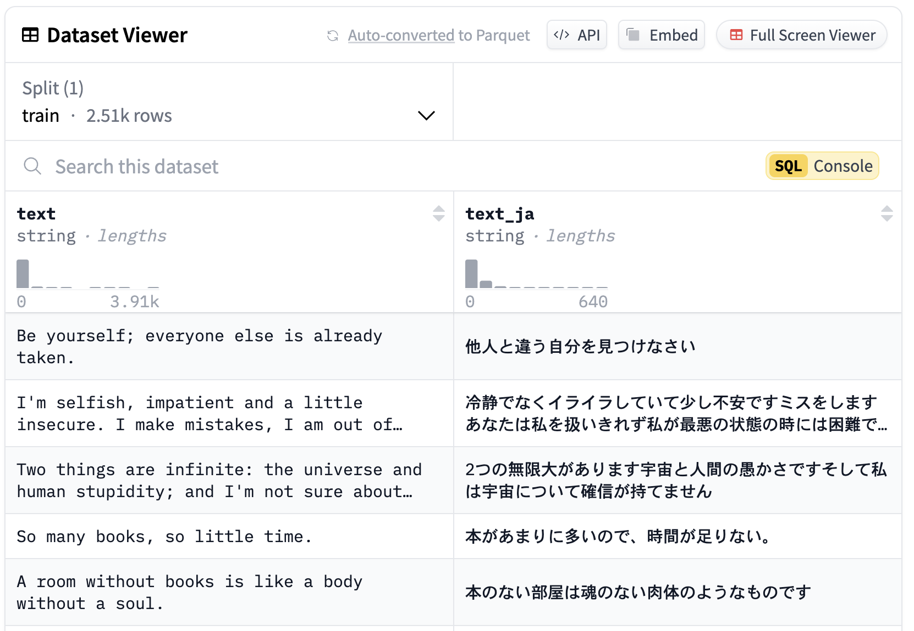
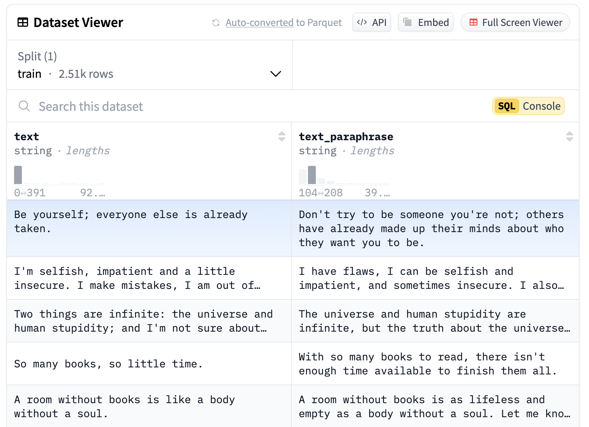

# text2dataset
[](https://pypi.python.org/pypi/text2dataset)

Easily turn large English text datasets into Japanese text datasets using open LLMs.

<figure>
  
  <figcaption> Fig: Japanese translation of the <a href="https://huggingface.co/datasets/Abirate/english_quotes">Abirate/english_quotes</a> dataset using the  <a href="https://huggingface.co/llm-jp/llm-jp-3-3.7b-instruct">llm-jp/llm-jp-3-3.7b-instruct</a> model. </figcaption>
</figure>

## Overview
text2dataset is a tool for converting a datasets.Dataset by translating the data in the "txt" column using Open LLM like gemma2 with vLLM, and adding a new "txt_ja" column (translated text in Japanese).
This tool is inspired by [img2dataset](https://github.com/rom1504/img2dataset).

## Features
- Save the intermediate results in shards:
  - By setting the `number_sample_per_shard` parameter, the dataset can be saved in shards as specified by the number of samples per shard.
- Resume from checkpoint:
  - By setting the `resume_from_checkpoint` parameter, the translation can be resumed from where it left off.
- Logging with wandb:
  - By setting the `use_wandb` parameter, the metrics such as examples_per_sec and count can be logged to wandb.
- Push to Hugging Face Hub:
  - By setting the `push_to_hub` parameter, the translated dataset can be pushed to the Hugging Face Hub.

## Installation
```bash
$ git clone https://github.com/llm-jp/text2dataset.git
$ rye sync
```

## Usage

### Translation
```bash
$ python src/text2dataset/main.py \
    --model_id llm-jp/llm-jp-3-3.7b-instruct \
    --batch_size 16384 \
    --input_path data/english_quotes.json \
    --source_column text \
    --target_column text_ja \
    --push_to_hub True \
    --push_to_hub_path speed/english_quotes_ja \
    --output_dir data/english_quotes_ja \
    --output_format json
```

Using the [`llm-jp/llm-jp-3-3.7b-instruct`](https://huggingface.co/llm-jp/llm-jp-3-3.7b-instruct) model on an A100 GPU, 2508 English quotes were translated into Japanese in just 21 seconds.
The result dataset is available at [speed/english_quotes_ja](https://huggingface.co/datasets/speed/english_quotes).


### Paraphrasing
You can also use text2dataset to paraphrase texts by changing the prompt template with specifying the `prompt_template_path` parameter.
```bash
$ python src/text2dataset/main.py \
    --model_id google/gemma-2-2b-it \
    --batch_size 16384 \
    --input_path data/english_quotes.json \
    --source_column text \
    --target_column text_paraphrase \
    --push_to_hub True \
    --push_to_hub_path speed/english_quotes_paraphrase \
    --output_dir data/english_quotes_paraphrase \
    --output_format json \
    --prompt_template_path config/paraphrase.yaml
```
The result dataset is available at [speed/english_quotes_paraphrase](https://huggingface.co/datasets/speed/english_quotes_paraphrase).



## Areas for Improvement
- Data Paarallel Inference:
  - Currently, only one model is used for inference. This can be improved by using DataParallel. If you know how to do this with vLLM, please let me know or Pull Request.

## Development

### Contribution
Welcome to any contributions!
If you have any questions or suggestions, please feel free to open an issue or Pull Request.

### PyPI Release
```bash
git tag -a v0.x.x -m "version 0.x.x"
git push origin --tags
```
### Lint and Format
```bash
$ rye lint
$ rye format
```

## References
- https://github.com/vllm-project/vllm
- https://github.com/rom1504/img2dataset
- https://huggingface.co/datasets/Abirate/english_quotes
